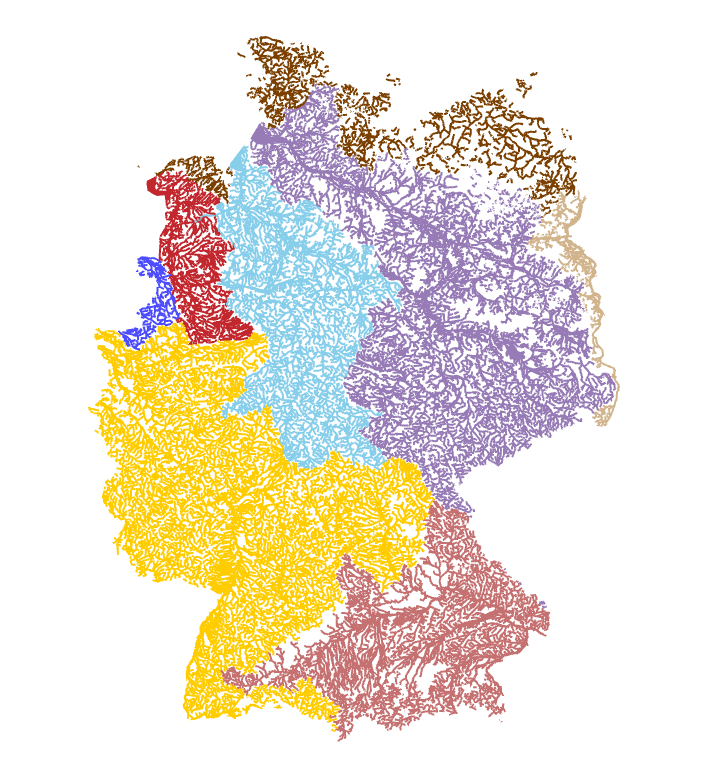
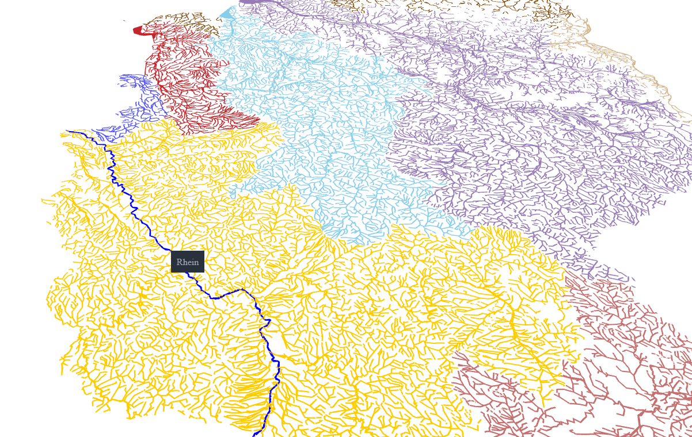

# German Rivers Demo

This project is a demo based on [deck.gl](https://deck.gl/), showcasing all rivers and streams in Germany (with a [GWK](https://en.wikipedia.org/wiki/Gew%C3%A4sserkennzahl)). The rivers are grouped into the various river systems. 

The data used in this demo originates from the [DLM250](https://gdz.bkg.bund.de/index.php/default/digitales-landschaftsmodell-1-250-000-ebenen-dlm250-ebenen.html) (Digitales Landschaftsmodell 1:250 000) provided by the [BKG](https://www.bkg.bund.de) (Bundesamt für Kartographie und Geodäsie) and has been compressed for efficient usage. The data is stored in GeoJSON format.

Users can interact with the map, and upon hovering over a river, the name of the river is displayed.

## Screenshots

